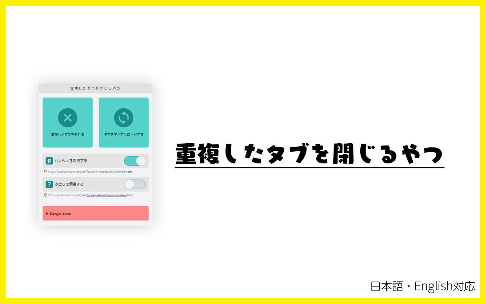

[English version is here.](./README--ja.md)

# 重複したタブを閉じる



仕事中はGitHubやRedmine、Backlogなどからたくさんの通知が来ます。

そういう時、あとで読もうと思って別タブで開いておくのを何度か繰り返していると、気がついた時にはあなたのブラウザはタブだらけ…。

このエクステンションはそんな状態で重複しているタブをすべて閉じ、残ったタブもまとめてリロードして最新状態をすぐに確認できます。

## 使い方

1. このブラウザ拡張のアイコンをクリックします
2. 必要に応じて設定を変更します（チェックボックス）
3. 使いたい機能ごとにボタンをクリックします

### URLの比較

初期値では、URLの比較にOrigin (Scheme + FQDN + Port)からクエリまでを利用します。

なお、比較時に次のようなデフォルトドキュメントは常に省略されます。

> /index.html  
> /index.htm  
> /index.xhtml  
> /index.php  
> /index.cgi  
> /index.aspx

たとえば、次のようなURLはすべて同じものとして扱われます。

```
https://www.example.com/
https://www.example.com/#baz
https://www.example.com/#bar
https://www.example.com/index.html#bar

→　https://www.example.com/
```

```
https://www.example.com/?a=100&b=200
https://www.example.com/?a=100&b=200#baz
https://www.example.com/?a=100&b=200#bar
https://www.example.com/index.html?a=100&b=200#bar

→　https://www.example.com/?a=100&b=200
```

### クエリを無視する

タブごとのURLの比較をするときに、URLクエリを無視するかどうかを切り替えるものです。

URLクエリとは、URLのうち次の範囲を指します。

```
https://www.example.com/?a=10&b=20#foo

-> ?a=10&b=20
```

クエリが無視されている場合、次のようなURLはすべて同じものとして扱われます。

```
https://www.example.com/
https://www.example.com/?a=10
https://www.example.com/?a=10&b=20
https://www.example.com/index.html?a=10&b=20

→　https://www.example.com/
```

### ハッシュを無視する

タブごとのURLの比較をするときに、URLハッシュを無視するかどうかを切り替えるものです。

URLハッシュとは、URLのうち次の範囲を指します。

```
https://www.example.com/?a=10&b=20#foo

-> #foo
```

ハッシュが無視されている場合、次のようなURLはすべて同じものとして扱われます。

```
https://www.example.com/
https://www.example.com/#foo
https://www.example.com/#bar
https://www.example.com/index.html#baz

→　https://www.example.com/
```

### 両方とも無視する

クエリとハッシュが無視されている場合、次のようなURLはすべて同じものとして扱われます。

```
https://www.example.com/
https://www.example.com/#baz
https://www.example.com/#bar
https://www.example.com/index.html#bar
https://www.example.com/?a=10
https://www.example.com/?a=10&b=20
https://www.example.com/?a=10&b=20#foo
https://www.example.com/?a=10&b=20#baz

→　https://www.example.com/
```
