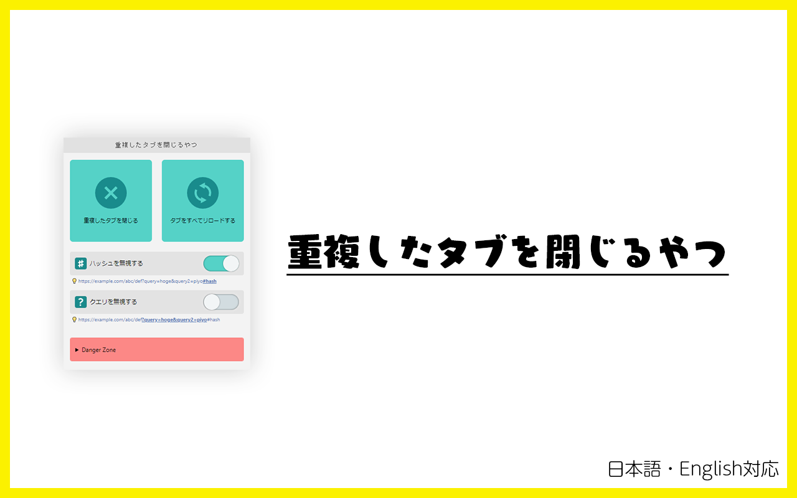
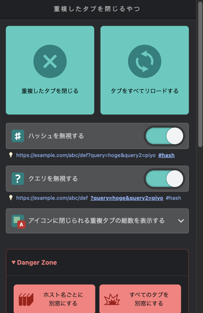
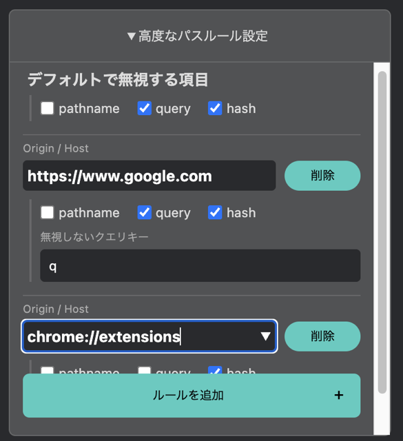

# 重複したタブを閉じるやつ

[](LICENSE)



[English version is here.](./README.md)

仕事中は GitHub や Redmine、Backlog などからたくさんの通知が来ます。

そういう時、あとで読もうと思って別タブで開いておくのを何度か繰り返していると、気がついた時にはあなたのブラウザはタブだらけ…。

このエクステンションはそんな状態で重複しているタブをすべて閉じ、残ったタブもまとめてリロードして最新状態をすぐに確認できます。

## Download

Google Chrome にインストールしてください。

[](https://chrome.google.com/webstore/detail/close-duplicate-tab/ollnnjepahcgphpjjhcfohpelmpldghj)

## 使い方

1. このブラウザ拡張のアイコンをクリックします
2. 必要に応じて設定（チェックボックス）を切り替えます
3. 使いたい機能のボタンをクリックします

## ボタン



| ボタン                           | 内容                                                                                                                                                                 |
| -------------------------------- | -------------------------------------------------------------------------------------------------------------------------------------------------------------------- |
| **重複したタブを閉じる**         | 重複しているタブを閉じます。実行前に「重複を確認」で閉じられるタブの一覧をプレビューできます。                                                                       |
| **タブをすべてリロードする**     | 開いているタブをすべてリロードします。溜まった通知タブをまとめて最新状態にしたいときに便利です。                                                                     |
| **ホスト名ごとに別窓にする**     | タブをホスト名ごとにグループ化し、ホストごとに新しいウィンドウを開きます。タブ数が少ないホストは「その他」としてまとめられるよう、まとめる枚数の閾値を設定できます。 |
| **すべてのタブを別窓にする**     | すべてのタブをそれぞれ別々のウィンドウに分割します。                                                                                                                 |
| **全ウィンドウを１つにまとめる** | 開いているすべてのウィンドウを1つのウィンドウにまとめます。                                                                                                          |
| **タブを並び変える**             | ウィンドウ内のタブを、URL優先／ページ名優先／ホスト名＋ページ名優先のいずれかで並べ替えます。                                                                        |

タブを閉じる・リロードする・分割する・まとめるといった破壊的な操作は、初期状態では確認ダイアログが表示されます。「確認ダイアログを表示しない」設定でこれを省略できます。

## 設定

### URL の比較

初期値では、URL の比較に Origin (Scheme + FQDN + Port)からクエリまでを利用します。

なお、比較時に次のようなデフォルトドキュメントは常に省略されます。

> /index.html  
> /index.htm  
> /index.xhtml  
> /index.php  
> /index.cgi  
> /index.aspx

たとえば、次のような URL はすべて同じものとして扱われます。

```
https://www.example.com/index.html
https://www.example.com/

→　https://www.example.com/
```

```
https://www.example.com/index.php#bar
https://www.example.com/index.htm#bar
https://www.example.com/index.cgi#bar
https://www.example.com/#bar

→　https://www.example.com/#bar
```

#### パス名を無視する

タブごとの URL の比較をするときに、URL のパス名を無視するかどうかを切り替えるものです。このオプションだけでは「ハッシュ」と「クエリ」は無視されないため、広く一致させたい場合はそれらのオプションと組み合わせてください。

### クエリを無視する

タブごとの URL の比較をするときに、URL クエリを無視するかどうかを切り替えるものです。

URL クエリとは、URL のうち次の範囲を指します。

```
https://www.example.com/?a=10&b=20#foo

-> ?a=10&b=20
```

クエリが無視されている場合、次のような URL はすべて同じものとして扱われます。

```
https://www.example.com/
https://www.example.com/?a=10
https://www.example.com/?a=10&b=20
https://www.example.com/index.html?a=10&b=20

→　https://www.example.com/
```

### ハッシュを無視する

タブごとの URL の比較をするときに、URL ハッシュを無視するかどうかを切り替えるものです。

URL ハッシュとは、URL のうち次の範囲を指します。

```
https://www.example.com/?a=10&b=20#foo

-> #foo
```

ハッシュが無視されている場合、次のような URL はすべて同じものとして扱われます。

```
https://www.example.com/
https://www.example.com/#foo
https://www.example.com/#bar
https://www.example.com/index.html#baz

→　https://www.example.com/
```

### 両方とも無視する

クエリとハッシュが無視されている場合、次のような URL はすべて同じものとして扱われます。

```
https://www.example.com/
https://www.example.com/#baz
https://www.example.com/#bar
https://www.example.com/index.html#bar
https://www.example.com/?a=10
https://www.example.com/?a=10&b=20
https://www.example.com/?a=10&b=20#foo
https://www.example.com/?a=10&b=20#baz

→　https://www.example.com/
```

### 高度なパスルール設定



上記の「パス名を無視する／クエリを無視する／ハッシュを無視する」は全サイト共通の設定です。「高度なパスルール設定を利用する」を有効にすると、オリジン（スキーム＋ホスト＋ポート）ごとにこの3つの設定を個別に上書きできます。

各オリジンのルールでは「無視しないクエリキー」も設定できます。オリジンのクエリを無視する設定にしていても、ここにカンマ区切りで指定したパラメータ名（例：`v,page`）だけは比較時に残されます。トラッキング用パラメータは無視しつつ、動画IDやページ番号のような意味のあるパラメータだけは維持したい場合に使います。

最近入力したオリジンは履歴として保持され、候補として再表示されます。誤って上書きしてしまった値も復元できます。

### 新しい重複タブを抑制する

有効にすると、新しいタブが開かれた瞬間に、上記と同じルールで重複と判定される既存タブがあればそちらへ即座に切り替え、新規タブを閉じます。新規タブページや一部の特殊なURLはこの対象外です。

### バッジ表示

拡張機能のアイコンに、重複数のバッジを表示できます。「表示しない」「閉じられる重複タブの総数を表示」「現在のタブとの重複数を表示」の3モードから選べます。

### その他のオプション

- **すべてのウィンドウを対象にする** — 有効にすると、各タスクが現在のウィンドウだけでなく開いているすべてのウィンドウを対象に動作します。
- **固定されたタブを対象にする** — 有効にすると、ピン留めされたタブも重複判定の対象になります。
- **URLハッシュを強制的に変更する** — 目次などのページ内リンクをクリックしたときに、URLを強制的に更新します。
