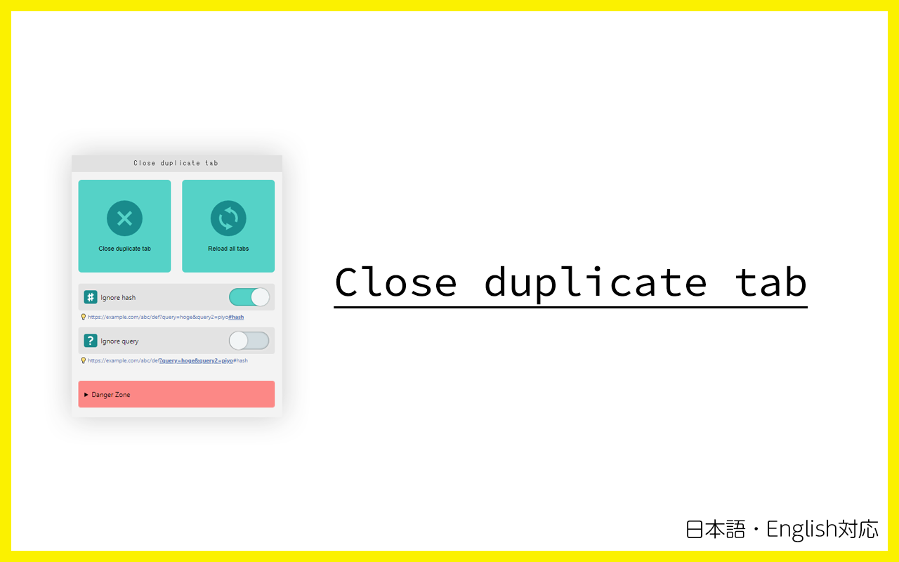

[日本語はこちら](./README--ja.md)

# Close duplicate tabs



At work, I get a lot of notifications from GitHub, Redmine, Backlog, and so on.

If you keep opening them in a new tab to read them later, you will have too many tabs in no time.

This Extension allows you to organize them in an instant and reload the remaining tabs to make them up-to-date!

## How to use

1. Click the Chrome Extension icon
2. Choose state of setting switches (checkbox)
3. Click buttons

### URL matching

By default, it will check for URL matches using from Origin (Scheme + FQDN + Port) to Query.

And the default document will then be ignored.

> /index.html  
> /index.htm  
> /index.xhtml  
> /index.php  
> /index.cgi  
> /index.aspx

In other words, all these URLs will be treated as identical.

```
https://www.example.com/
https://www.example.com/#baz
https://www.example.com/#bar
https://www.example.com/index.html#bar

→　https://www.example.com/
```

```
https://www.example.com/?a=100&b=200
https://www.example.com/?a=100&b=200#baz
https://www.example.com/?a=100&b=200#bar
https://www.example.com/index.html?a=100&b=200#bar

→　https://www.example.com/?a=100&b=200
```

### Ignore the query

This flag determines whether or not to ignore the URL query when comparing the URLs in each tab.

A URL query is this range in URL.

```
https://www.example.com/?a=10&b=20#foo

-> ?a=10&b=20
```

If the query is ignored, All these URLs are considered to be the same.

```
https://www.example.com/
https://www.example.com/?a=10
https://www.example.com/?a=10&b=20
https://www.example.com/index.html?a=10&b=20

→　https://www.example.com/
```

### Ignore the hash

This flag determines whether or not to ignore the URL hash when comparing the URLs in each tab.

A URL hash is this range in URL.

```
https://www.example.com/?a=10&b=20#foo

-> #foo
```

If the hash is ignored, All these URLs are considered to be the same.

```
https://www.example.com/
https://www.example.com/#foo
https://www.example.com/#bar
https://www.example.com/index.html#baz

→　https://www.example.com/
```

### Ignore them both

If query and hash are ignored, , All these URLs are considered to be the same.

```
https://www.example.com/
https://www.example.com/#baz
https://www.example.com/#bar
https://www.example.com/index.html#bar
https://www.example.com/?a=10
https://www.example.com/?a=10&b=20
https://www.example.com/?a=10&b=20#foo
https://www.example.com/?a=10&b=20#baz

→　https://www.example.com/
```
