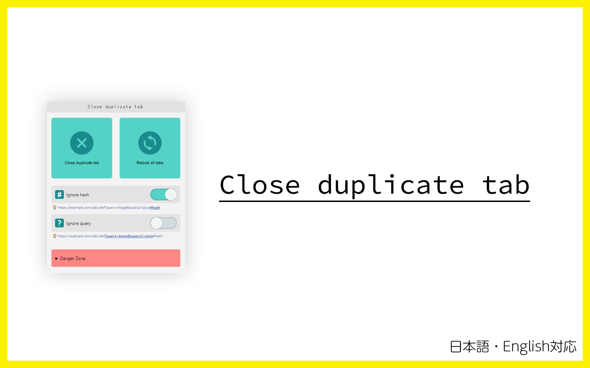
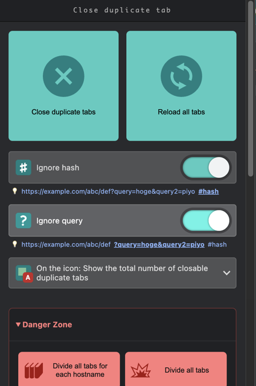
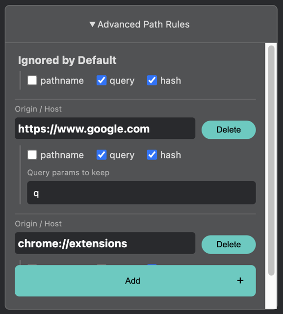

# Close duplicate tabs

[](LICENSE)



[日本語はこちら](./README--ja.md)

At work, I get a lot of notifications from GitHub, Redmine, Backlog, and so on.

If you keep opening them in a new tab to read them later, you will have too many tabs in no time.

This Extension allows you to organize them in an instant and reload the remaining tabs to make them up-to-date!

## Download

Install it on your Google Chrome from here.

[](https://chrome.google.com/webstore/detail/close-duplicate-tab/ollnnjepahcgphpjjhcfohpelmpldghj)

## How to use

1. Click the Chrome Extension icon
2. Choose the state of the setting checkboxes for the behavior you want
3. Click one of the buttons below to run a task

## Buttons



| Button                                  | What it does                                                                                                                                                                                                    |
| --------------------------------------- | --------------------------------------------------------------------------------------------------------------------------------------------------------------------------------------------------------------- |
| **Close duplicate tabs**                | Closes duplicate tabs. Before closing, it can show a preview list of the tabs that would be closed (**Find Duplicates**).                                                                                       |
| **Reload all tabs**                     | Reloads every tab, useful for refreshing a batch of notification tabs at once.                                                                                                                                  |
| **Divide all tabs for each hostname**   | Groups all tabs by hostname, opening one new window per hostname. When a hostname has only a few tabs, you can set a threshold so those get bundled into a single "others" window instead of many tiny windows. |
| **Divide all tabs**                     | Opens every tab in its own separate window.                                                                                                                                                                     |
| **Combine all windows into one window** | Merges every open window back into a single window.                                                                                                                                                             |
| **Sort the tabs**                       | Sorts tabs within each window, by URL, by page title, or by hostname + page title.                                                                                                                              |

Destructive tasks (closing, reloading, dividing, combining) show a confirmation dialog by default; this can be turned off with the **Do not show confirmation dialog** setting.

## Settings

### URL matching

By default, it will check for URL matches using from Origin (Scheme + FQDN + Port) to Query.

And the default document will then be ignored.

> /index.html  
> /index.htm  
> /index.xhtml  
> /index.php  
> /index.cgi  
> /index.aspx

In other words, all these URLs will be treated as identical.

```
https://www.example.com/index.html
https://www.example.com/

→　https://www.example.com/
```

```
https://www.example.com/index.php#bar
https://www.example.com/index.htm#bar
https://www.example.com/index.cgi#bar
https://www.example.com/#bar

→　https://www.example.com/#bar
```

#### Ignore pathname

This flag determines whether or not to ignore the URL pathname when comparing the URLs in each tab. Note that enabling it does not, by itself, ignore the query or hash as well — combine it with those flags if you want a broader match.

#### Ignore the query

This flag determines whether or not to ignore the URL query when comparing the URLs in each tab.

A URL query is this range in URL.

```
https://www.example.com/?a=10&b=20#foo

-> ?a=10&b=20
```

If the query is ignored, All these URLs are considered to be the same.

```
https://www.example.com/
https://www.example.com/?a=10
https://www.example.com/?a=10&b=20
https://www.example.com/index.html?a=10&b=20

→　https://www.example.com/
```

#### Ignore the hash

This flag determines whether or not to ignore the URL hash when comparing the URLs in each tab.

A URL hash is this range in URL.

```
https://www.example.com/?a=10&b=20#foo

-> #foo
```

If the hash is ignored, All these URLs are considered to be the same.

```
https://www.example.com/
https://www.example.com/#foo
https://www.example.com/#bar
https://www.example.com/index.html#baz

→　https://www.example.com/
```

#### Ignore them both

If query and hash are ignored, , All these URLs are considered to be the same.

```
https://www.example.com/
https://www.example.com/#baz
https://www.example.com/#bar
https://www.example.com/index.html#bar
https://www.example.com/?a=10
https://www.example.com/?a=10&b=20
https://www.example.com/?a=10&b=20#foo
https://www.example.com/?a=10&b=20#baz

→　https://www.example.com/
```

### Advanced Path Rule



The **Ignore pathname / query / hash** flags above apply globally to every site. **Use advanced path rule settings** lets you override those three flags per origin (scheme + host + port) instead, so different sites can use different matching rules.

For an origin's rule, you can also set a **query params to keep** allowlist: even while that origin's query is ignored, listed parameter names (comma-separated, e.g. `v,page`) are still kept when comparing URLs. This is useful for sites where the query contains something meaningful (a video ID, a page number) mixed in with tracking parameters you want to ignore.

Recently entered origins are remembered and offered back as suggestions, so an accidental overwrite can be restored.

### Suppress new duplicate tabs

When enabled, opening a new tab that duplicates an already-open tab (matched using the same rules as above) immediately switches to the existing tab and closes the new one, instead of leaving both open. New tab pages and some special URLs (`chrome://`, etc.) are excluded from this behavior.

### Badge

The extension icon can show a duplicate count badge, in one of three modes: off, the total number of closable duplicate tabs, or the number of tabs duplicating the current tab.

### Other options

- **Include all windows** — when enabled, tasks operate across every window instead of only the current one.
- **Include pinned tabs** — when enabled, pinned tabs are also considered when detecting duplicates.
- **Force URL Hash Change** — forces the URL to update when clicking intra-page links, such as those in a table of contents.
